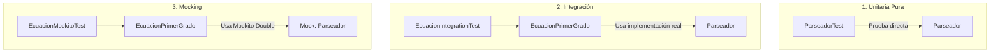
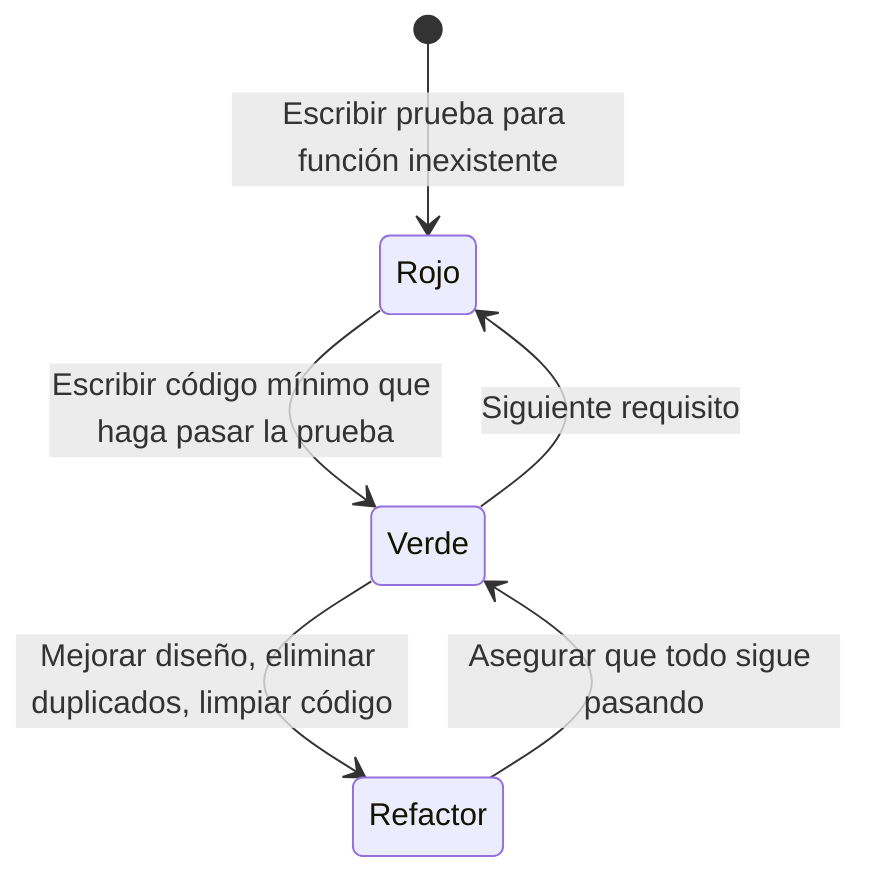

# Guía Completa de Aprendizaje: Fundamentos de Testing y TDD

Este documento sirve como material de estudio teórico y práctico sobre los conceptos, arquitecturas y metodologías de pruebas de software implementadas en este repositorio.

---

## 1. Fundamentos y Pirámide de Testing

### ¿Por qué probamos el software?
1. **Prevención de regresiones**: Asegura que nuevo código o refactorizaciones no rompan funcionalidades previas.
2. **Diseño guiado**: Escribir pruebas obliga a diseñar código modular, desacoplado y con responsabilidades claras (Single Responsibility Principle).
3. **Documentación viva y ejecutable**: Una suite de pruebas explica exactamente cómo se espera que funcione cada componente del sistema mejor que cualquier manual desactualizado.
4. **Confianza en despliegues continuos**: Permite integrar y desplegar cambios rápidamente con certeza de estabilidad.

### La Pirámide de Pruebas (Mike Cohn)

```text
       / \
      / E2E \       <- Pocas, lentas, costosas, prueban flujos de usuario completos
     /-------\
    / Integr. \     <- Moderadas, verifican comunicación entre módulos/servicios
   /-----------\
  /   Unitarias \   <- Muchas, ultra rápidas, aisladas, económicas
 /---------------\
```

| Nivel | Propósito | Costo & Velocidad | Ejemplo en este Repo |
| :--- | :--- | :--- | :--- |
| **Unitaria** | Probar una unidad atómica (método, clase, función) de forma aislada. | Ultra rápida (<1ms), bajo costo | `CalculatorTests.java`, `ParseadorTest.java`, `test_product_service.py` |
| **Integración** | Probar la interacción correcta entre dos o más unidades de software reales. | Rápida, costo medio | `EcuacionPrimerGradoIntegrationTest.java` |
| **Componente / UI** | Probar el comportamiento de interfaz interactuando como un usuario real. | Moderada | `TaskManager.test.tsx` (Vitest + React Testing Library) |

---

## 2. Estructura Estándar de una Prueba: Patrón AAA (Arrange - Act - Assert)

Toda prueba bien diseñada debe estructurarse en tres fases claras:

```java
@Test
void sumaDosNumerosCorrectamente() {
    // 1. ARRANGE (Organizar / Preparar el escenario)
    Calculator calc = new Calculator();
    int a = 20;
    int b = 30;

    // 2. ACT (Actuar / Ejecutar la operación bajo prueba)
    int resultado = calc.add(a, b);

    // 3. ASSERT (Afirmar / Verificar el resultado obtenido vs esperado)
    assertEquals(50, resultado, "La suma de 20 y 30 debe ser 50");
}
```

*Nota: En BDD (Behavior-Driven Development) este patrón equivale a **Given - When - Then**.*

---

## 3. Bloque 1: JUnit 5 en Java y Kotlin (`1-junit5-running-tests/`)

### Arquitectura de JUnit 5
A diferencia de JUnit 4 (que era un monolito), JUnit 5 se compone de tres módulos:
- **JUnit Platform**: Motor base para descubrir y ejecutar tests en la JVM o desde consolas/IDEs.
- **JUnit Jupiter**: El nuevo modelo de programación y extensión (anotaciones modernas `@Test`, `@ParameterizedTest`, etc.).
- **JUnit Vintage**: Provee compatibilidad hacia atrás para ejecutar pruebas escritas en JUnit 3 y JUnit 4.

### Anotaciones y Técnicas Clave en este Proyecto

#### 1. `@BeforeEach` (Aislamiento de Estado)
```java
private Calculator calculator;

@BeforeEach
void setUp() {
    calculator = new Calculator();
}
```
> **Principio de Independencia**: Cada test debe ejecutarse sobre un estado limpio. Si se reutilizara la misma instancia en memoria entre tests, un test que modifique el estado interno podría provocar falsos positivos o negativos en los demás.

#### 2. `@DisplayName` y `@Tag`
- `@DisplayName("...")`: Proporciona una descripción legible en español o formato empresarial en lugar del nombre camelCase del método.
- `@Tag("fast")` / `@Tag("math")`: Permite etiquetar pruebas para ejecutarlas selectivamente (por ejemplo, filtrar solo pruebas rápidas en un pipeline de CI/CD).

#### 3. Pruebas Parametrizadas (`@ParameterizedTest` + `@CsvSource`)
Evita duplicar métodos cuando la lógica de validación es idéntica pero cambian los datos de entrada y salida:
```java
@ParameterizedTest(name = "{0} + {1} = {2}")
@CsvSource({
    "0,    1,   1",
    "1,    2,   3",
    "49,  51, 100",
    "1,  100, 101"
})
void addParameterized(int first, int second, int expectedResult) {
    assertEquals(expectedResult, calculator.add(first, second));
}
```

#### 4. Aserciones Agrupadas (`assertAll`)
En pruebas tradicionales con múltiples `assertEquals`, si la primera falla, el test se aborta y nunca sabrás si las siguientes pasaban o fallaban:
```java
assertAll("Grouped Assertions",
    () -> assertEquals(2, calculator.add(1, 1)),
    () -> assertEquals(0, calculator.subtract(1, 1)),
    () -> assertEquals(2, calculator.divide(4, 2))
);
```
`assertAll` evalúa **todas** las lambdas y presenta un reporte consolidado con todos los fallos juntos.

#### 5. Pruebas de Excepciones (`assertThrows`)
Probar que el sistema falle adecuadamente ante entradas inválidas es tan crucial como probar el camino feliz:
```java
IllegalArgumentException exception = assertThrows(
    IllegalArgumentException.class,
    () -> calculator.divide(1, 0),
    "Dividir por cero debe lanzar IllegalArgumentException"
);
assertEquals("Division by zero", exception.getMessage());
```

---

## 4. Bloque 2: Unitaria vs Integración vs Mocking con Mockito (`2-softtek-testing-unitario/`)

Este ejercicio ilustra la diferencia entre probar clases solas, juntas o simuladas resolviendo ecuaciones lineales $ax \pm b = c \implies x = \frac{c - b}{a}$.

### Concepto del SUT (System Under Test)
El **SUT** es el objeto específico cuya lógica interna estamos examinando en una prueba determinada.

### Las 3 Formas de Probar el Flujo



#### Comparativa Técnica:

1. **Unitaria Pura (`ParseadorTest.java`)**:
   - SUT: `Parseador`.
   - Verifica que strings como `"2x + 1 = 0"` o `"x - 3 = 5"` separen correctamente coeficientes $a$, $b$, $c$ y el operador.

2. **Integración (`EcuacionPrimerGradoIntegrationTest.java`)**:
   - SUT: `EcuacionPrimerGrado` + `Parseador` (ambos reales).
   - Problema si falla: Si la prueba falla, **no sabes de inmediato si falló el cálculo algebraico o si falló el parseador de texto**.

3. **Con Dobles de Prueba / Mocking (`EcuacionPrimerGradoMockitoTest.java`)**:
   - SUT: Exclusivamente `EcuacionPrimerGrado`.
   - Dependencia `Parseador` es reemplazada por un **Mock** inyectado:
   ```java
   @Mock
   private Parseador parseador;

   @InjectMocks
   private EcuacionPrimerGrado ecuacion;

   @Test
   public void resolverEcuacionConMock() {
       // Configurar el doble (Stubbing): no importa cómo parsee, forzamos valores fijos
       when(parseador.getParte1()).thenReturn(2);
       when(parseador.getParte2()).thenReturn(1);
       when(parseador.getParte3()).thenReturn(0);
       when(parseador.getOperador()).thenReturn("+");

       double resultado = ecuacion.solucionar("cualquier texto");

       // Verificamos únicamente el cálculo matemático: (0 - 1) / 2 = -0.5
       assertEquals(-0.5, resultado, 0.001);
   }
   ```
   > **Ventaja**: Si un día cambias el formato del parser o éste tiene un bug, las pruebas de `EcuacionPrimerGrado` **no se romperán**, porque aíslan la responsabilidad matemática de la responsabilidad de parseo.

---

## 5. Bloque 3: Metodología TDD (Desarrollo Guiado por Pruebas)

TDD no es una técnica de testing; es una técnica de **diseño de software** asistida por pruebas.

### El Ciclo Rojo - Verde - Refactorizar



1. **Fase Roja**: Escribir una prueba unitaria pequeña que falle (por compilación o por aserción).
2. **Fase Verde**: Escribir el código estrictamente necesario para que pase (incluso retornando valores fijos temporales).
3. **Fase de Refactor**: Mejorar nombres, extraer constantes o métodos y simplificar algoritmos con la red de seguridad de los tests.

### Casos de Estudio en los 3 Lenguajes

#### 1. Python (`unittest`) – Lógica de Negocio y Validación
- Se diseñó el servicio `ProductService` a partir de pruebas de reglas de dominio:
  - No permitir nombres vacíos (`ValueError`).
  - No permitir precios ni stock negativos.
  - Generación de UUIDs únicos para cada producto.
  - Errores específicos al buscar o eliminar IDs inexistentes (`KeyError`).

#### 2. Go (`testing`) – Concurrencia y Control de Errores Tipados
- En Go, las pruebas no usan aserciones mágicas; se usa código Go estándar con `t.Errorf` / `t.Fatalf`.
- Implementación de `sync.RWMutex` en `UserService`:
  - Bloqueos de lectura (`RLock`) para consultas `GetByID` y `GetAll`.
  - Bloqueos exclusivos de escritura (`Lock`) para `Create`, `Update`, `Delete`.
  - Validación de duplicidad de correo electrónico antes de insertar.

#### 3. React + TypeScript (`Vitest` + React Testing Library) – Enfoque Black-Box
- En lugar de probar variables de estado internas (`useState`) o nombres de funciones, se prueba la perspectiva del usuario final:
  1. *El usuario escribe un título y hace click en "Agregar Tarea"* $\to$ la nueva tarea aparece en la lista del DOM.
  2. *El usuario marca el checkbox de completado* $\to$ el texto cambia de estilo a tachado.
  3. *El usuario pulsa el botón "Editar"* $\to$ se habilita un campo de texto con el valor actual.
  4. *El usuario pulsa "Eliminar"* $\to$ la tarea desaparece de la vista.

---

## 6. Buenas Prácticas: Principios FIRST

Toda suite de pruebas profesional debe cumplir los 5 principios FIRST:

- **Fast (Rápida)**: Las pruebas deben correr en milisegundos. Si tardan minutos, los desarrolladores dejarán de correrlas.
- **Independent (Independiente)**: Ninguna prueba debe depender de que otra prueba se haya ejecutado antes ni en un orden específico.
- **Repeatable (Repetible)**: Debe dar el mismo resultado en cualquier máquina, entorno (local, Docker, CI) y sin depender de red o fechas variables.
- **Self-validating (Auto-verificable)**: La prueba debe pasar (verde) o fallar (rojo) por sí sola, sin requerir inspección manual de logs.
- **Timely (Oportuna)**: Las pruebas deben escribirse en el momento oportuno (antes o junto con el código de producción, no meses después).

---

## 7. Preguntas Frecuentes para Repasar en la Universidad

1. **¿Cuál es la diferencia entre un Stub y un Mock?**
   - Un **Stub** provee respuestas enlatadas/prefijadas a llamadas hechas durante la prueba (ej: devolver siempre un usuario simulado).
   - Un **Mock** además verifica el comportamiento: registra cómo fue llamado (número de veces, parámetros recibidos) para validar la interacción.

2. **¿Por qué `@BeforeEach` es preferible a inicializar variables en la declaración de la clase de prueba?**
   - Porque JUnit crea una nueva instancia antes de cada método `@Test`, garantizando que variables modificadas en un test anterior no contaminen los tests posteriores.

3. **¿Qué valor aporta una prueba parametrizada frente a un bucle `for` dentro de un `@Test` tradicional?**
   - Si un bucle `for` falla en la segunda iteración, el test falla y oculta el resultado de las siguientes 10 iteraciones. Una prueba parametrizada corre cada iteración como un test independiente en el reporte final.

4. **¿Por qué React Testing Library desaconseja probar el estado interno de los componentes?**
   - Si pruebas el estado interno (`component.state.count`), cuando refactorices el componente a un Custom Hook o Redux, la prueba se romperá aunque para el usuario la pantalla funcione igual (prueba frágil). Si pruebas lo que el usuario ve en pantalla (`getByText('Count: 1')`), el test resiste cualquier refactorización interna.